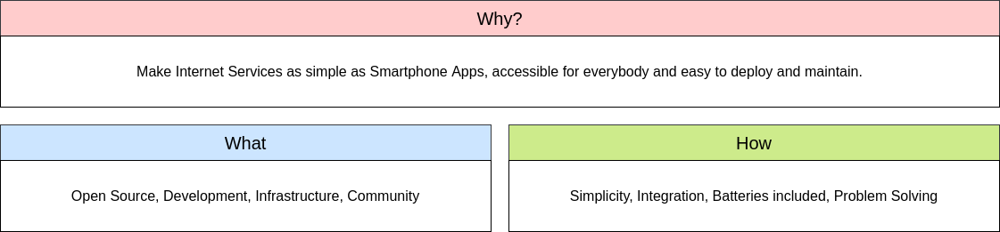

# Introduction

Welcome to [while-true-do.io](https://while-true-do.io)! We are group of people,
that want to make the administration and usage of common internet services
easier and more consumer friendly.

## Why are we doing this?

If you want to know why we are doing this and what motivates us, this section
may be right for you. If not, we suggest to read it anyway and see if you can
identify yourself with it.

### Statement

If you want to pin us down to a single statement, we might say something like:

> Make Internet Services as simple as Smartphone apps, accessible for everybody
> and easy to deploy and maintain.

If this is too abstract to begin with, we have formulated the problems we want
to solve in the below story.

### Story

We are living in a world, where basically every service is available. Sometimes
these internet services are free, sometimes you need to pay something. If you
want to share a calendar or a file, just create an account somewhere. If you
want to work with your team, you may also find suitable software for you.

But what if you are having a group of people, that want to share a calendar,
have a chat with another, share a file and publish a small website? This group
may be your family, a sports club or your new company.

You will either have someone with lots of experience that puts everything
together or hundreds of accounts on different platforms. Both is complex, hard
to maintain and reduces your time for things you really want to do.

Furthermore, most of these software tools are invented as "standalone" solution.
This means, if you host a calendar, it will be the best calendar the vendor can
offer. There will be hundreds of features to enhance the marketing portfolio for
the calendar application. And of course, exporting the data to another calendar
software is not even supported.

That is something we want to solve at
[while-true-do.io](https://while-true-do.io).

## What are we doing?

Developing and providing tools that help you to avoid the massive complexity
that you will face, either by maintaining hundreds of accounts or by hosting
tens of services, is our main objective. We are doing this in four objectives.

### Open Source

The **cover objective** is **Open Source**. This indicates, that we are
developing Open Source code exclusively and try to be as transparent as
possible. Even blog articles, pictures, diagrams and more will be licensed to be
re-used, adapted, tweaked and shared.

### Development

The **first core objective** is **Development**. We want to provide software,
that helps people to get things going. You will see Ansible playbooks,
Kubernetes YAMLs, but also full-fledged apps or libraries at some point.

- develop specifications and conventions for an integrated software ecosystem
- develop useful and simple software that integrates with each other
- develop a platform that is easy to deploy and support

A detailed description about our Development efforts is maintained by the
[SIG Development](./development/SIG_DEVELOPMENT.md).

### Infrastructure

The **second core objective** is **Infrastructure**. We will provide
infrastructure for ourselves, but also provide guides and code, so you can run
it on your own.

- develop and maintain documentation to setup our software
- develop and maintain automation code for our own and 3rd party software
- develop and maintain the infrastructure for ourselves
- provide demonstration instances for our deployments

You can find more information about our Infrastructure work in the
[SIG Infrastructure](./infrastructure/SIG_INFRASTRUCTURE.md).

### Community

The **third core objective** is **Community**. We want to integrate users,
enthusiasts and professionals in our development, but also provide technical
insights and guidance, if you want to learn more.

- establish community channels to communicate with others
- publish articles and resources to get in touch with our tooling
- connect with other communities
- find formats to further connect with experts, enthusiasts and beginners

The community work is explained in more details in the
[SIG Community](./community/SIG_COMMUNITY.md).

## How are we doing this?

You may ask: "How are you doing this now?" or "Are there any paradigms, you
are following?". It's good that you ask. This section explains our mindset,
principles and ideals.

### Simplicity

Simplicity must be reflected in all regards. The interface must be easy for the
users. The operator must have access to simple guidelines to deploy our
software. The developer must get a stable and simple API and software
architecture to develop for the platform.

### Integration

The software and services we are developing should be easy to integrate with
each other. A user may want to publish a web page, where the event calendar is
integrated. Since both (the calendar and the web software) are simple and
different applications, there must be a way to integrate them. This example must
be applied for every newly developed service and each service should provide
possibilities so other services can interact with it.

### Batteries included

Running an internet service like a website often means, that you will get
thousands of options to change the text and picture, but nothing that helps you
to track visitors or push your new articles to social media channels. A calendar
can provide statistics about meetings or additional weather informations, too.
Including these options in a meaningful and user focused way should be
considered for every new software piece.

### Solving problems

Introducing a new feature should always solve a specific user problem. Instead
of providing fancy features, that are nice in a marketing spreadsheet, we want
to solve real problems and not introduce new ones.
