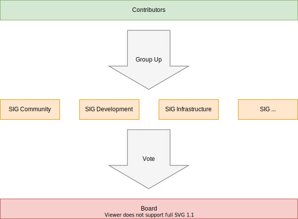

# Organization

This document describes our organization. It should give a brief overview
how we are working on things and where you might need to reach out to.

## Diagram

## Contributors

Basically everybody who helps the project is a contributor. We even see users
as valuable contributors. In case you raise a question, report a bug or
request a feature, you are already contributing to the project.

Let us thank you for your contribution. It is lovely to have you in our
community.

## Special Interest Groups

Every group of contributors can form a Special Interest Group (SIG). If you are
into Design, Blogging, Container, or whatever helps the project moving forward,
please feel free to form a group or join an existing one.

A SIG must follow some rules to be created and seen as maintained:

- there must be at least 3 permanent members
- every SIG must fill in Product Requirements Document to describe its purpose,
  objectives and paradigms
- the PRD must be reviewed once a year
- every SIG must have regular, public meetings (ex: every week in IRC)
- the request to open a SIG must be done as a pull request in our
  [organizational repository](https://github.com/whiletruedoio/.github)
- the pull request will be reviewed, refined and approved by the board, but
  all community members are invited to support

After the approval, a SIG can start with the work. There will be an initial
Meeting with the Board and one other SIG to discuss the next steps and demand.

## Board

The board is made up of permanent SIG members and represents the project. It
is meant as a challenger for ideas, menthor and advisor for the SIGs. In
addition, the Board will take care of knowledge gathering and sharing.

There is a voting once a year where every SIG is proposing a candidate.
The list of proposed candidates will be made available and the voting will be
held anonymously. The new Board will discuss a grace period for handover and
methorship from previous board members.
