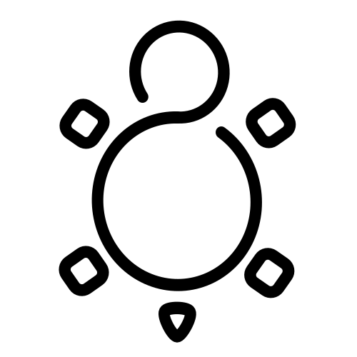

# while-true-do.io

Open Source - Development, Infrastructure, Community

## :book: Introduction

Welcome to [while-true-do.io](https://while-true-do.io)! We are group of
people, that want to make the administration and usage of common internet
services easier and more consumer friendly.

You can read our full
[introduction](https://github.com/whiletruedoio/.github/blob/main/docs/README.md)
if you want to know more about our vision and goals.

The short-form is something like this: "Make Internet Services as simple as
Smartphone apps, accessible for everybody and easy to deploy and maintain."

## :rocket: Contribution

First off, thanks for taking time and considering to contribute. We really
appreciate every contribution in form of reports, requests, discussions and
every piece, that will help to grow the project.

If you want to join the hard work or get in touch with us, please check out the
below documents.

- [Code of Conduct](https://github.com/whiletruedoio/.github/blob/main/docs/CODE_OF_CONDUCT.md)
- [Contribution Guideline](https://github.com/whiletruedoio/.github/blob/main/docs/CONTRIBUTING.md)

If you consider to contribute, but you don't know where to start, please have a
look at the
[open Issues](https://github.com/issues?q=is%3Aopen+is%3Aissue+org%3Awhiletruedoio+archived%3Afalse)
and
[open Pull Requests](https://github.com/pulls?q=is%3Aopen+is%3Apr+org%3Awhiletruedoio+archived%3Afalse).
